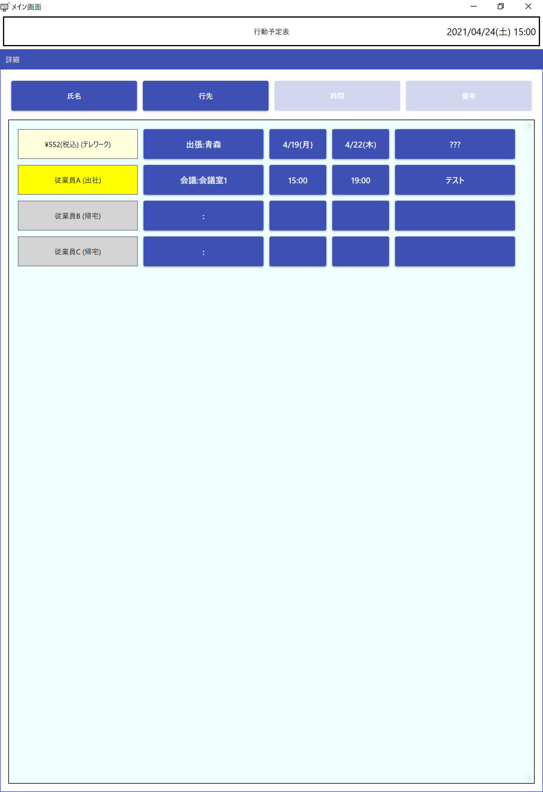
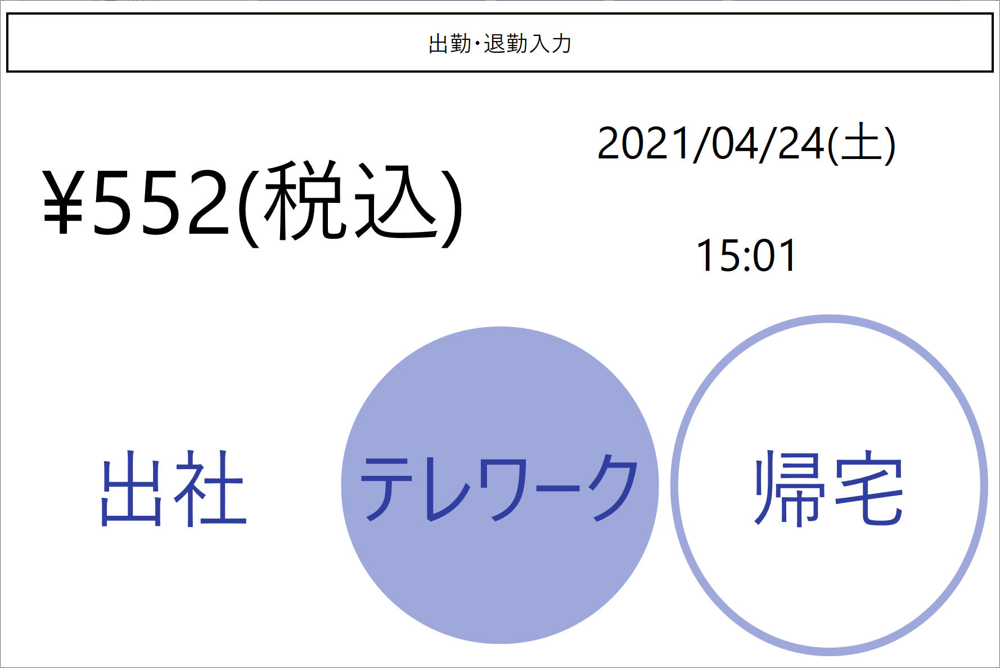

# 行先ボードアプリ

ホワイトボードで運用していると思われる
行先ボード（行動予定表）をデジタル化してみようという試みです。

## 開発情報
### 開発環境
- Microsoft Visual Studio Community 2019
- .NET 5.0

### ビルド方法

以下の3つのプロジェクトを取得します。
- [Destinationboard](https://github.com/zeikomi552/Destinationboard)
- [DestinationboardServer](https://github.com/zeikomi552/DestinationboardServer)
- [DestinationboardCommunicationLibrary](https://github.com/zeikomi552/DestinationboardCommunicationLibrary)

すべて同階層に配置してください。

Microsoft Visual Studio Community 2019
を使用すればビルドが通ると思います

## 起動方法
### 実行ファイルの取得
以下の場所から実行ファイルを取得します
https://github.com/zeikomi552/Destinationboard/releases

### 実行ファイルの配置
実行ファイルは以下の2種類に分かれています。
- DestinationboardServer(サーバー用)
- Destinationboard(クライアント用)

それぞれ任意のPCに配置してください。
とりあえず試したい場合は同じPCに配置するとすぐにお試しできます。

### 設定ファイルの変更

Destinationboard\Config\Destination.confを変更します。

```
<ConfigManager xmlns:xsi="http://www.w3.org/2001/XMLSchema-instance" xmlns:xsd="http://www.w3.org/2001/XMLSchema">
  <ServerName>localhost</ServerName>
  <Port>552</Port>
</ConfigManager>
```

DestinationServer\Config\DestinationServer.confを変更します。

```
<?xml version="1.0"?>
<ConfigManager xmlns:xsi="http://www.w3.org/2001/XMLSchema-instance" xmlns:xsd="http://www.w3.org/2001/XMLSchema">
  <HostName>localhost</HostName>
  <Port>552</Port>
  <SQLitePath>.\db\DestinationBoard.db</SQLitePath>
</ConfigManager>
```

### 起動順序

以下の順でアプリケーションを起動します。
- DestinationboardServer.exe
- Destinationboard.exe

## 画面イメージ

### メイン画面


### 設定画面 - 従業員設定画面


### 出勤・退勤入力画面


### 設定画面 - 行先設定画面


### 行動入力画面


### 日時入力画面


### 備考入力画面


